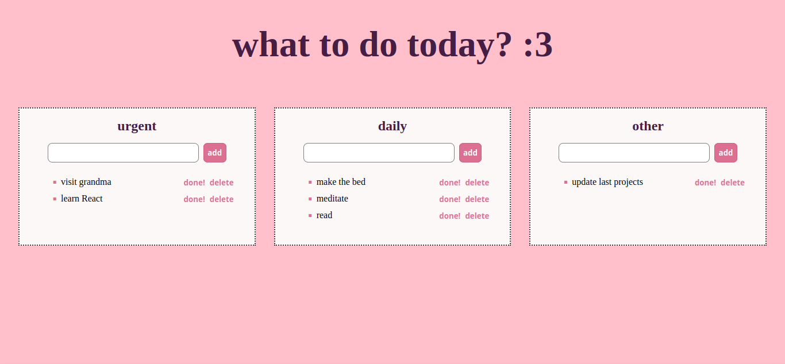

# React To-Do List

This is a simple React to-do list app developed by me to learn basics of React.

### Tech Stack
`HTML` `SCSS` `CSS` `JavaScript` `React`

### Description

The app is divided into three sections - types of tasks: urgent, daily and other tasks. User doesn't have to delete one when it's done, which is helpful especially with daily task. They can push *done!* button to cross it out, but it remains on the list. Delete button deletes added task completely.

### Learnings
- functions
- React
- React hooks
- state management
- styling HTML page with CSS/SCSS

### Screenshot
